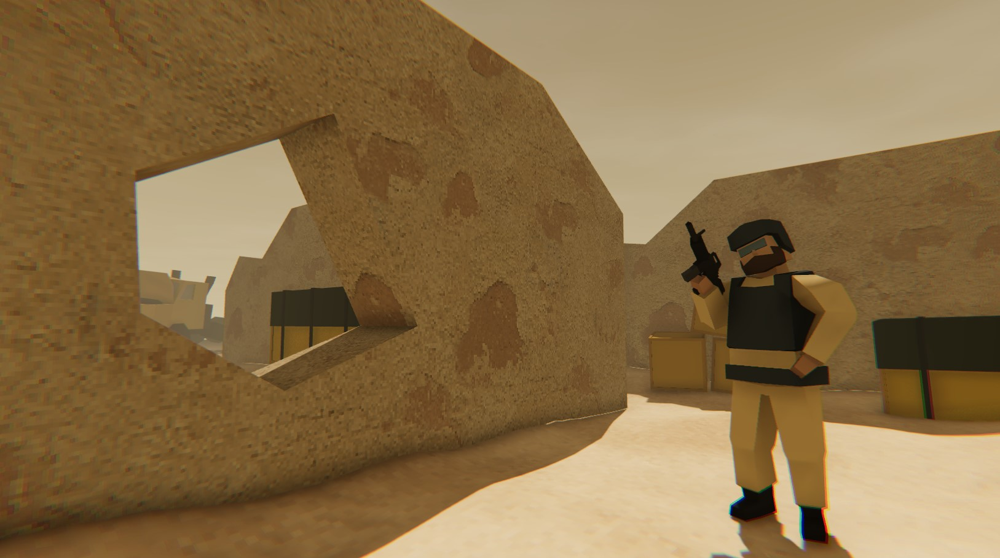

# FPS project playground
#### This is a place for crutches and prototyping exposed public

## Requirements
- Unity 2021.3

## Features
- Super low poly models done on the knee
- Simple RigidBody movement by adding force, no wall stuck, no camera jitter while rotating
- Full body with FPS hands - same rig, same skinned mesh parts, uses Unity's AnimationRigging
- Naive implementation for character motion on top of AnimatorController driven by Animator states (lol just because)
- Footstep sounds for both legs with trigger colliders attached to the heels

## Upcoming
- Guns will shoot once decided what is the most kinky way to implement it
- NPCs on behavior trees
- Menu with buttons